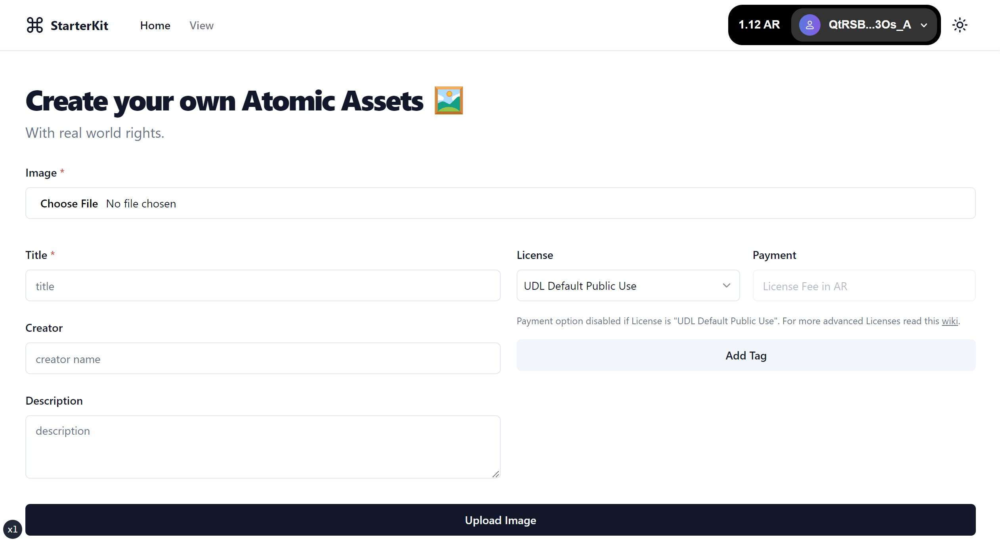
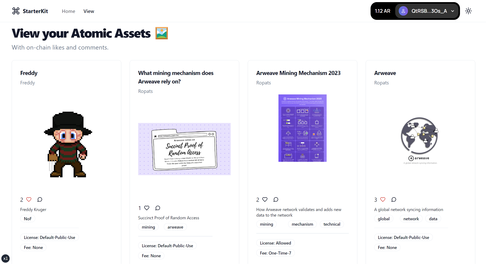

# Arweave StarterKit

Fast track your journey to building decentralized applications on Arweave with the Arweave StarterKit. A CLI tool that effortlessly sets up an entire application, harnessing the power of [NextJS](https://nextjs.org/) as the framework, [Shadcn UI](https://ui.shadcn.com/) for a sleek and aesthetic interface, and [ArweaveKit](https://arweavekit.com/?utm_source=Github&utm_medium=StarterKit+Repo&utm_campaign=Create-Arweave-App+StarterKit+Docs&utm_id=Create-Arweave-App+StarterKit+Docs) to seamlessly interact with the Arweave ecosystem.

## Getting Started

First, run the development:

```bash
npm run dev
# or
yarn dev
# or
pnpm dev
# or
bun dev
```

Open [http://localhost:3000](http://localhost:3000) in your browser to see the result.

**Landing Page:** A form that allows users to upload Atomic assets on Arweave, complete with various metadata configurations.



**View Page:** A dedicated space to view the uploaded assets and engage with them through on-chain likes (known as stamps) and comments.



Start editing the page by modifying `app/page.tsx` or `pages/index.ts`, as per your NextJS config.

## Why use a StarterKit?

Building DApps from scratch can be a daunting task. From setting up the environment to ensuring compatibility across different components, the process can be time-consuming. A starter kit provides a pre-configured foundation, enabling developers to focus on building unique features and functionalities rather than the underlying setup.

## What are the key components of the StarterKit?

- **Navbar:** A built-in navigation bar that integrates with [Arweave Wallet Kit](https://docs.arweavekit.com/wallets/wallet-kit?utm_source=Github&utm_medium=StarterKit+Repo&utm_campaign=Create-Arweave-App+StarterKit+Docs&utm_id=Create-Arweave-App+StarterKit+Docs), enabling users to connect to and interact with the DApp effortlessly.

- **Landing Page:** A landing page featuring a form, typesafed with [Zod](https://zod.dev/) schemas. Users can upload images and add metadata, which is then posted to the Arweave network as an [atomic asset](https://cookbook.arweave.dev/concepts/atomic-tokens.html).

- **Atomic Assets and Contracts:** Each asset is paired with an associated contract, enabling alterations to the metadata and transfer of ownership.

  The created project is initialized with a contract which is located at `src/contracts`. You can make necessary modifications to the contract code according to your needs and run the script `deploy-contracts` to automatically update the contract linked functionality to the new one.

  ```bash
  # With wallet.json keyfile present at root
  yarn deploy-contracts
  # With keyfile present at a custom path
  yarn deploy-contracts /Users/arweave/Documents/keys/wallet.json
  ```

- **View Page:** A space to showcase assets and metadata, augmented with features like [Stamps](https://stamps.arweave.dev/#/en/main) (Arweave's version of 'likes') and [on-chain comments](https://specs.ar-io.dev/#/view/SYCrxZYzhP_L_iwmxS7niejyeJ_XhJtN4EArplCPHGQ).

## Leverage Modularity

The true strength of this kit lies in its modularity. Simply interchange the core asset from image to music and transform an image sharing application to a music hub. Or swap in for videos to create a streaming service. As any form of data can be uploaded to the Arweave network, the possibilities are limitless.

## Start Building

Ready to build your first application on Arweave? [Get started now!](https://github.com/labscommunity/starterkit/blob/main/apps/cli/README.md)

Checkout the [ArweaveKit docs](https://docs.arweavekit.com/arweavekit/introduction?utm_source=Github&utm_medium=StarterKit+Repo&utm_campaign=Create-Arweave-App+StarterKit+Docs&utm_id=Create-Arweave-App+StarterKit+Docs) to customize the application and add more features and follow us on [X](https://twitter.com/CommunityLabs) to stay updated on all things Arweave.
